# 单线图自动布局：一个有意思的小问题

最近写了个开源的电气单线图编辑器（[sldeditor](https://github.com/NovaShang/sldeditor)），里头有个看似不起眼、实则反复打磨过好几轮的部件：自动布局。

它干的事情很简单 —— 给定一堆元件和连线，自动算出每个元件画在画布上的 `(x, y, 旋转角)`。但要让生成的图"看着像样"，要远比"不报错"困难。这篇随便聊聊这个算法的设计思路，以及一路上踩过的坑。

## 为什么这件事不简单

单线图（Single Line Diagram，SLD）是变电站、配电系统的标准化技术图。一张典型的图有这么几条特征：

- **母线水平**，元件竖着挂，链状的开关从上往下串
- **同电压母线在同一水平线**（典型双母线、三段母线）
- **变压器把高压母线和低压母线连起来**，自然产生跨电压等级的"层"
- **接线整齐、不交叉**，相同电气节点的引线靠近彼此

这些约束乍看都不算什么，但放到一起就形成了一个有趣的小问题：**布局不是物理上的重力或弹簧仿真，而是一组结构化的领域审美**。在通用力导向算法（force-directed graph drawing）下出来的图，专业人员一看就知道是机器画的 —— 连线扭曲、母线倾斜、变压器横在中间。

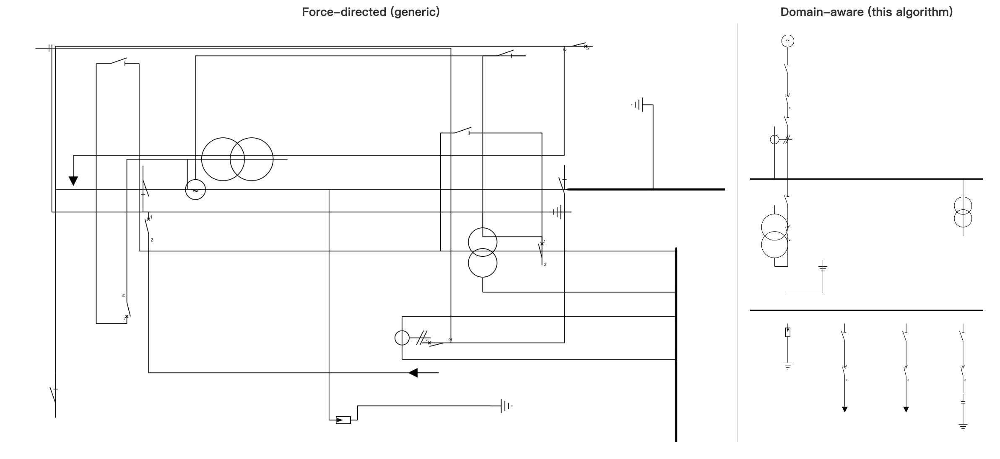

要做"看上去像电气工程师手画的"图，必须把领域规则编码进算法本身。我把这个算法分成几个相对独立的层级，下面一层层说。

## 元件库：先把"形状"建模对

每个元件（断路器、隔离开关、变压器、负荷……）在元件库里被定义成一段 SVG 加一组**端子（terminal）**：

```jsonc
{
  "id": "breaker",
  "viewBox": "-7 -22 15 46",
  "width": 15,
  "height": 46,
  "svg": "...",
  "terminals": [
    { "id": "t1", "x": 0, "y": -20, "orientation": "n" },
    { "id": "t2", "x": 0, "y":  20, "orientation": "s" }
  ]
}
```

端子有**位置**（在元件本地坐标系下）和**朝向**（"出线方向"）。这两条信息构成了布局的物理基础：把一个端子"贴到母线上"，等价于把元件平移到 `母线坐标 - 端子本地坐标`。把元件旋转 180°，端子的朝向跟着翻一翻。

这个看似平凡的建模决定了后面所有事的清爽程度。如果元件只有"宽高"没有"端子位置"，你就无法精确地把电气节点对齐；如果端子没有"朝向"，你就无法判断"这个开关接到母线上后，链应该往上长还是往下长"。

## 母线 / 链 / 节点：三个核心抽象

整个布局算法围绕三个概念展开：

**母线（busbar）** 是水平的"主轴"，元件挂在它上面。母线本身是一根线段，宽度（span）按它承载的内容动态计算。

**链（chain）** 是一串首尾相连的元件，从母线出发往一个方向延伸。比如一条馈线：母线 → 隔离开关 → 断路器 → 负荷。链上每个元件占据一列，按朝向竖直排列。

**电气节点（electrical node）** 是一组"电势相同"的端子集合 —— 物理上接到同一根铜排或同一个汇流点。节点的概念在源数据里是隐式的：JSON 里写若干条 `connection` 数组（成员两两共点），算法用并查集（union-find）把它们合并成等价类。

并查集这一步看似纯数据结构问题，但它直接决定了后面"放置时谁该挨着谁"。早期的版本没有显式的节点概念，靠遍历 connection group 一对一地链式放置，结果遇到三个并联分支挂在同一汇流点时，BFS 会把它们硬塞进一条竖列里 —— 后两个挨着第一个排队、还会撞母线。

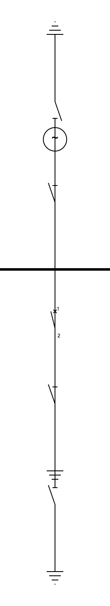

一旦把"节点"作为一等公民，这类问题立刻消失：同节点的所有未放置元素，作为**并联分支**沿垂直方向铺开就行。

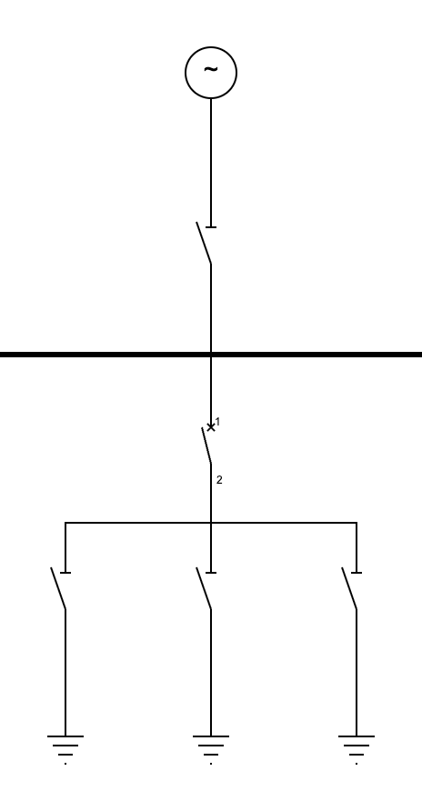

## 分层：让母线"垂直堆叠"还是"水平并排"

这是这个算法里我觉得最微妙的一层。

直觉上，多条母线就该一根接一根从上往下堆。但实际遇到双母线（两根 220kV 母线 + 母联开关）时，这个直觉就翻车了 —— 两根同电压等级的母线应该**左右铺开、共用一条水平线**，而不是垂直堆叠。

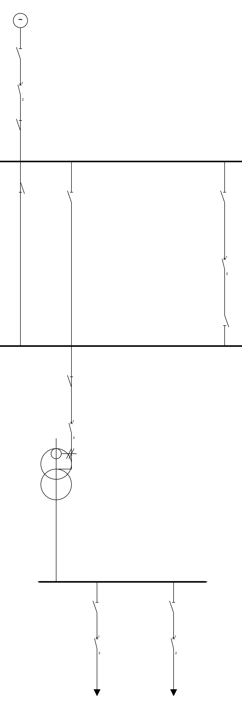

解决办法是给每条母线分一个**层级（tier）**。从源端母线开始 BFS，遇到变压器（vertical linker）跨层 +1，遇到母联（horizontal linker）保持同层。同层母线共用 Y 坐标、横向铺开；跨层之间的 Y 间距由变压器链长动态决定。

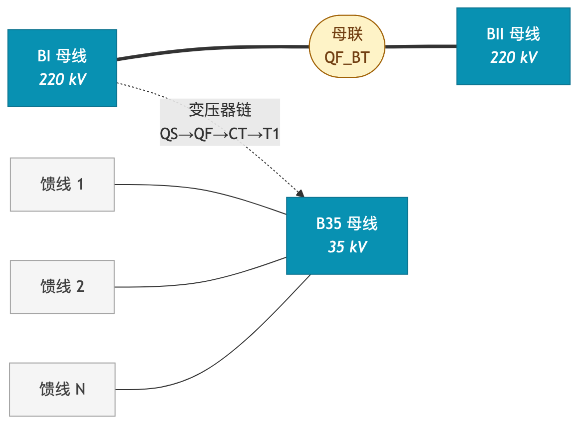

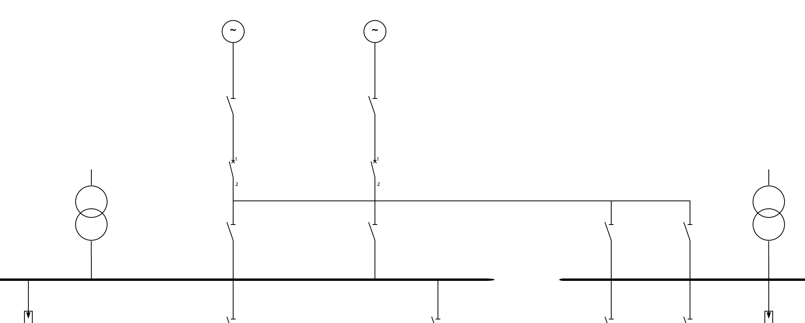

横向 / 纵向 linker 的分类不是配置出来的，而是**自动检测**的。变压器走一种 BFS（"找到 ≥2 条不同母线，路径上经过自己"），母联走另一种（"两个端子分别 BFS 到不同母线，路径上不允许穿过变压器"）。后一条规则非常关键 —— 它让算法能区分"线路断路器"（一端是电网、不是 linker）和"母联断路器"（两端都是母线、是 linker），不靠用户标注。

## 宽度从下往上推

母线的宽度（span）不是固定的，而是**自下而上递归算出来的**。

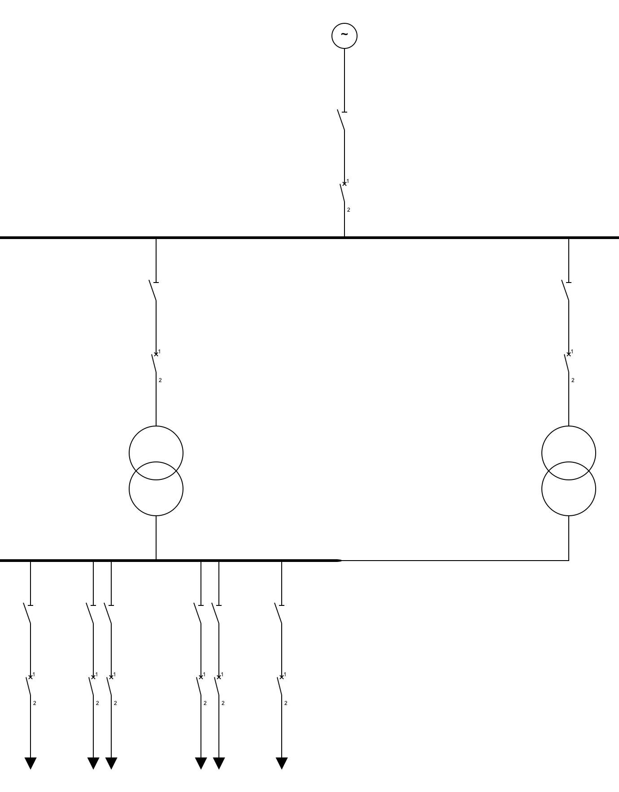

每条母线下挂的若干"槽位"（slot）宽度之和，加点边距，就是它需要的最小宽度。普通元件的槽位宽度就是它自己的 SVG 宽度（向上取一个最小间距）。但如果某个槽位是"通往子母线的引入位"（比如变压器的高压侧引线），它的槽位宽度必须 ≥ 子母线的宽度 + 间距，否则两条子母线在画布上会水平重叠。

这条规则递归往上传播：B2 上挂 4 条馈线 → B2 宽度 ≈ 400px → B1 上 T1 那一槽宽度 ≥ 480px。如果 B1 同时还挂着 T2（通往 B3），那 B1 至少得有 ≥ 800px 才能不让 B2/B3 在画面上互相叠到。这是我整个算法里花了最长时间想清楚的一步。一旦算出每条母线的宽度，后面的"母线放在哪个 X、子母线又放在哪个 X"几乎是机械的：父母线居中放，每个子母线放在它对应槽位的 X 上。

## 并联分支：节点 + 投票 + 不动点

接下来是把"挂"在母线下方的元件们摆好。这部分是另一个反直觉的地方：**两个端子在同一个电气节点上 ≠ 它们应该挨着排**。

举个具体的：

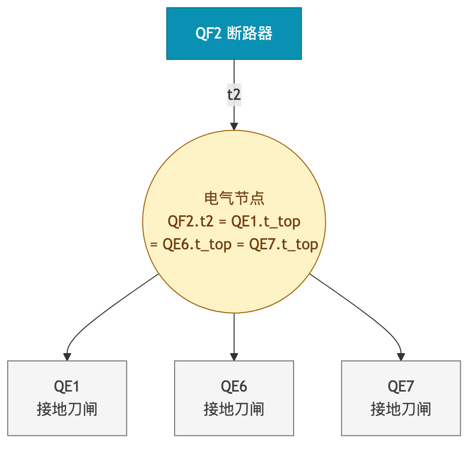

数据上这是 4 个端子在同一节点，物理上是 QF2 下方一根短水平母排连着三个并联的接地刀闸。

修法是把节点作为一等公民。每个电气节点先找出已放置的端子作为 anchor 候选；然后通过**投票**选 anchor —— 看每个未放置元素和哪个已放置端子在原始 connection 里**直接共现**，给那个候选投一票，得票最多的当选；最后把所有未放置元素**沿 anchor 出线方向的垂直方向**铺开。

投票这步看似奇怪，但它优雅地解决了 anchor 歧义。比如多个 tap 都接到同一根母线、某个新元件该指向哪个？让"原始 connection 共现"做仲裁，比按 BFS 顺序"先到先得"靠谱多了。

外面再包一层**不动点循环**：每轮把能放的全放了，下一轮新放的元素成为更下层未放置元素的 anchor。这避免了"先深后广"和"先广后深"的取舍 —— 只要有进展就再来一轮，没进展就停。

## 槽位的微妙之处

母线下方的槽位排序也藏着一些细节。

最容易想到的是按 tap 在源数据里的顺序均匀分布。但当母线之间有水平连接（母联）时，这就不对了：母联的链头希望落在**靠近对方母线**的那一端。比如 BI 上的 QS_BT_I 应该在 BI 的右侧（贴近 BII），而 BII 上的 QS_BT_II 应该在 BII 的左侧（贴近 BI），这样母联那条线最短。

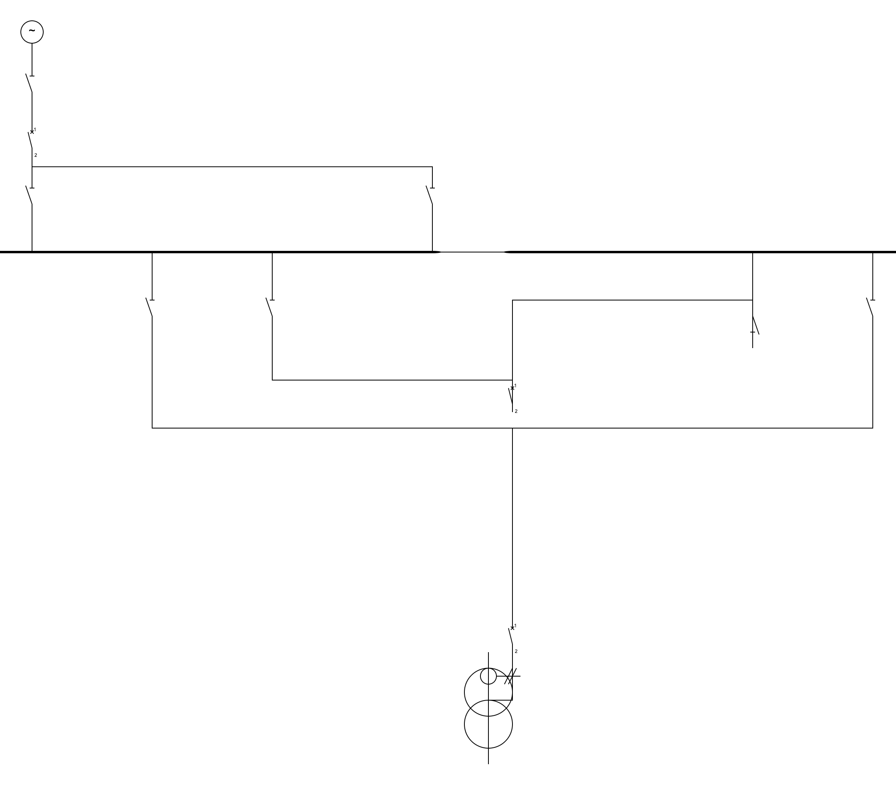

引入"目标 X"概念：每个 tap 沿连接图 BFS，找它最近能到的另一条**已放置母线**，用对方的 X 作为这个 tap 的偏好位置。然后按偏好升序排序、从左往右分配槽位。

但还有一个 tiebreak 问题：宽槽位（变压器引入位，可能 800+ px）和窄槽位（母联开关，80 px）如果偏好同向，谁排前？答案是**宽的居中、窄的极端**。窄槽位被推到边缘后才能真正贴近对方母线；如果让宽槽位先占边缘位置，它的中心反而离不到边、还把窄槽位挤到中间。这条规则我盯着输出看了好一会儿才悟出来。

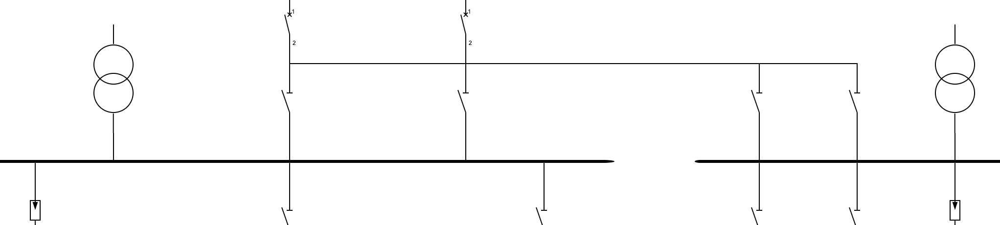

## 复杂 case：3 母线变压器与母联横放

整个算法稳定下来后，开始拿真实 fixture 拍：220kV 双母线 + 母联 + 主变 + 35kV 母线 + 多条馈线。这时候会跳出几个新问题。

**第一个：3-bus 变压器。** 双母线下挂的主变 T1 实际上通过两个隔离开关（QS_T1_I 接 BI、QS_T1_II 接 BII）汇合到 T1 的一端 —— 物理上是个 Y 形分叉：

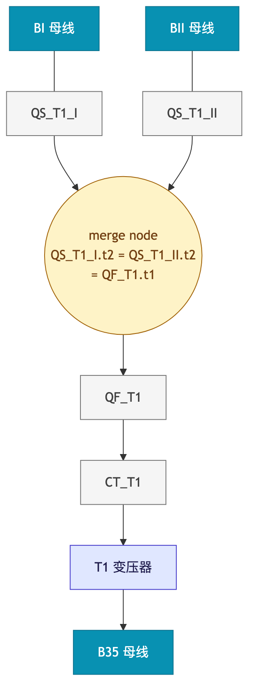

早期 BFS 走到第一条母线就停，T1 注册为 2-bus linker，另一边的 QS_T1_II 就退化成 BII 的普通 tap，引线被迫斜跨到 QF_T1 那一列，画出来一根难看的对角长线。

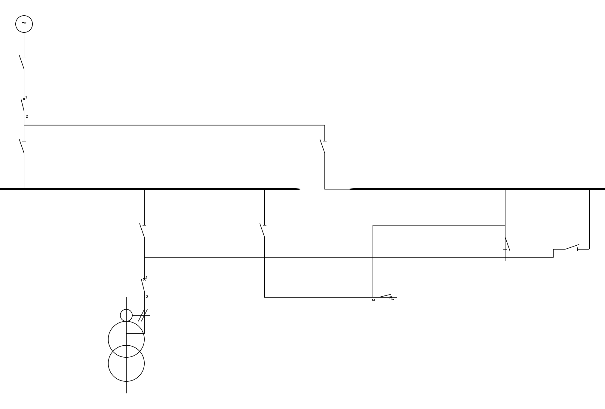

修法分两步。**首先把 BFS 改成不停、走完全图**，T1 的 attachments 真实记录成 `[{BI, t1}, {BII, t1}, {B35, t2}]` 三条边。**然后让 placeLinker 识别多个上游 attachments**：把所有同 level 的 chain head 找出来，linker 放在它们 X 坐标的**中点**。

这一步只解决了 linker 自身的位置；chain 上其他元件（QF_T1、CT_T1）还呆在 BI 的列里，T1 跑到中点反而让 CT_T1.t2 → T1.t1 多了一根 320px 的横向引线。所以又加了一个反向链行走 —— 从 linker 出发沿 chain 一步步往母线方向走，每一步把元件钉到 linker 的 X 列上，直到撞到一个**多端子节点**（merge node）就停。撞到 merge node 之后剩下的事就交给 auto-route：QS_T1_I.t2 / QS_T1_II.t2 / QF_T1.t1 三个端子在同一节点，渲染时画成横向 rake + Tee 形下挂。

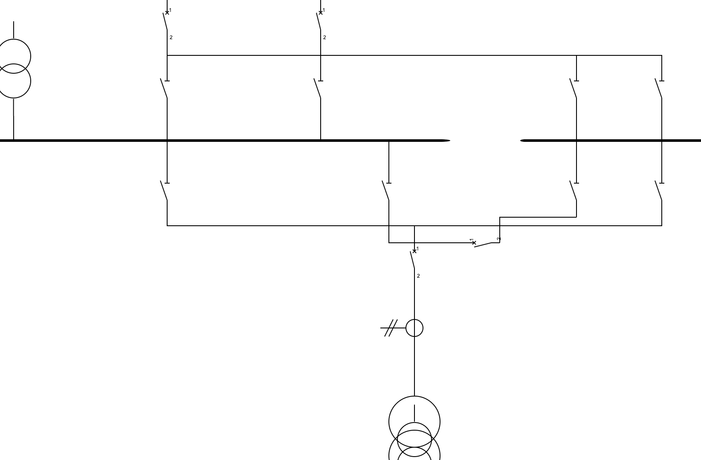

**第二个：母联横放。** 母联是水平 linker，物理上的 QF_BT 是横躺的 —— 但默认链式放置竖着走，QF_BT 莫名其妙挂在 QS_BT_I 下方，剩下另一边 1200px 的横线让 auto-route 苦哈哈地连。

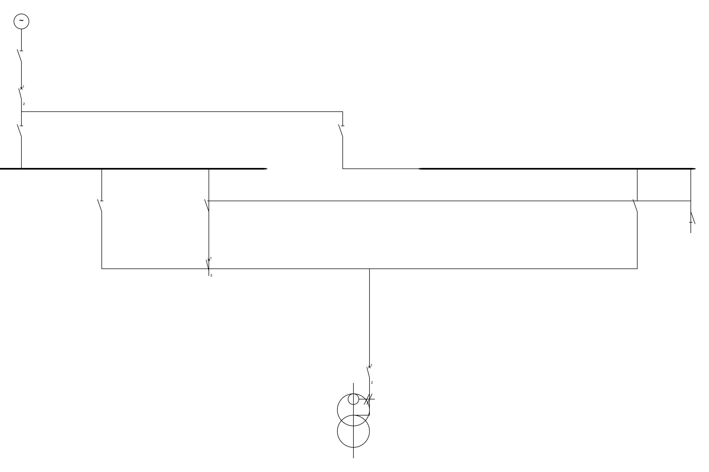

修法直接：单独给水平 linker 做一道放置 —— **旋转 90°/270°**（取决于哪个端子接左母线）、放在两条母线 X 中点、Y 落在 chain extent 的尽头。BI 一侧的 QS_BT_I 还是老老实实当 BI 的 tap 挂着，QF_BT 横躺在两 disconnector 中间，左右各一段约 90px 的 L 形短引线。

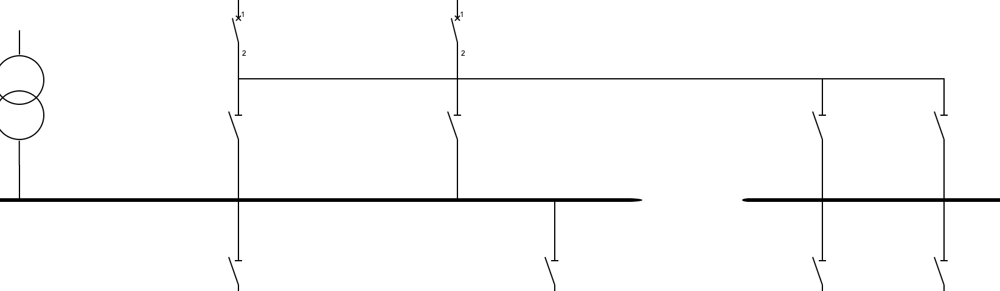

这两条修复合起来让复杂 fixture 第一次显得"像个变电站"：

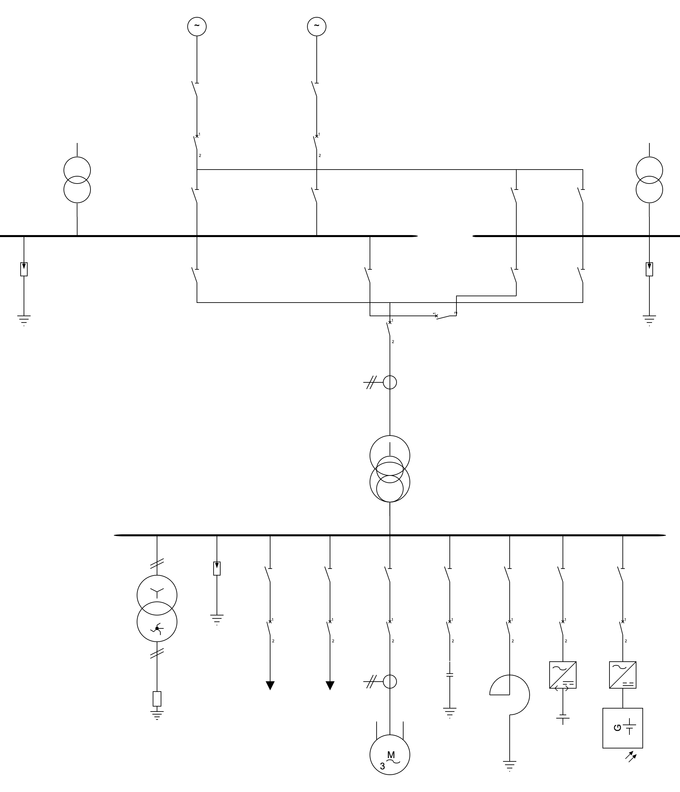

## 还有的局限

诚实地说，这个算法还不是完美的。几个明知存在但暂时没动的事：

**美学规则的硬编码**：很多审美约定（比如"接地符号永远在链的最末端"、"避雷器贴近母线"）目前是隐式靠端子位置和元件库定义实现的。如果要支持非标准元件或者自定义图形，就需要更显式的规则系统。

**自动布线**：自动布局只决定元件位置，**连线的具体走向**是另一个算法（autoroute）的事。两者目前各干各的、有时会打架（比如布局给的两个端子隔得很远、布线就没法画出整齐的直角线）。理想情况下两者应该耦合优化。

**非对称 chain**：3-bus 变压器我假定两侧 chain 长度相等（实际中通常对称）。如果一边多了一节 CT、另一边没有，短的那侧 chain 会留个 stub。可以通过把 chain 间距等比拉伸去填，但暂时没动。

**Bay 级别的对齐**：单条馈线（隔离开关 → 断路器 → 负荷）现在是从母线往下一节节算 X 的，没有"bay"这个一等概念。在大型变电站里，希望"出线柜"的所有元件共享一根 X 轴是合理的，但要把这种约束加进现有递归 span 计算里得重写一些。

## 收尾

写这个东西的过程让我对"做对一个看似简单的小问题"重新有了点敬畏。

每次以为想透了、加个新案例就翻车 —— 三母线、母联、并联分支、不同的端子方向、Y 形分叉 —— 每个新案例都是一面镜子，照出之前模型的不完整。直到把"端子"、"链"、"电气节点"、"层级"、"orientation 标签"、"merge node"这几个抽象立稳了，代码才慢慢变得稳定，新案例不再需要打补丁、而是顺着模型自然就工作。

回头看，最有用的是这条：**先把领域里的概念建对，再写算法**。不靠 collision detection 硬撑，不靠 magic number 调参 —— 靠把问题描述本身写清楚。剩下的事情，BFS、union-find、bottom-up 递归这些本科算法课的内容就足够了。

代码在 [NovaShang/sldeditor](https://github.com/NovaShang/sldeditor)，欢迎拍砖。
